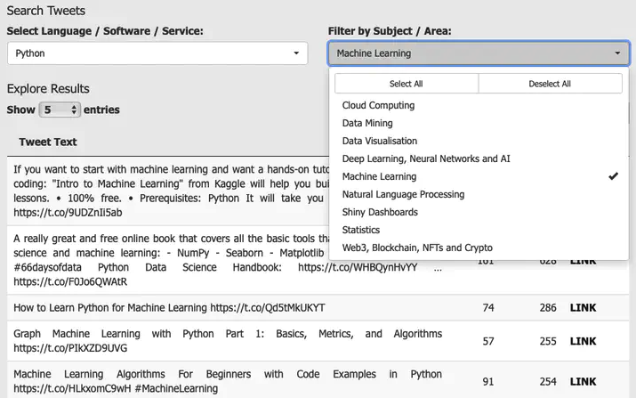

# Twitter Favourites Shiny Repo

For a working example, see [https://craigfots.shinyapps.io/tech-and-data-tweets/](https://craigfots.shinyapps.io/tech-and-data-tweets/)
For a more detailed explanation of this workflow, see [this post](https://www.popmusicresearch.org/post/twitter-repo/) on my website 

Build an interactive Shiny repo of resources gathered from Twitter likes in 3 simple steps

## 1: Gather your liked Tweets

Use the `rtweet` package to download all the tweets you have 'liked'

## 2: Filter results for data science terms

Filter those tweets based on the appearance of a) key words, b) URLs

## 3: Create your Runtime Shiny Markdown file.

Create a Runtime Shiny document to explore the results. 